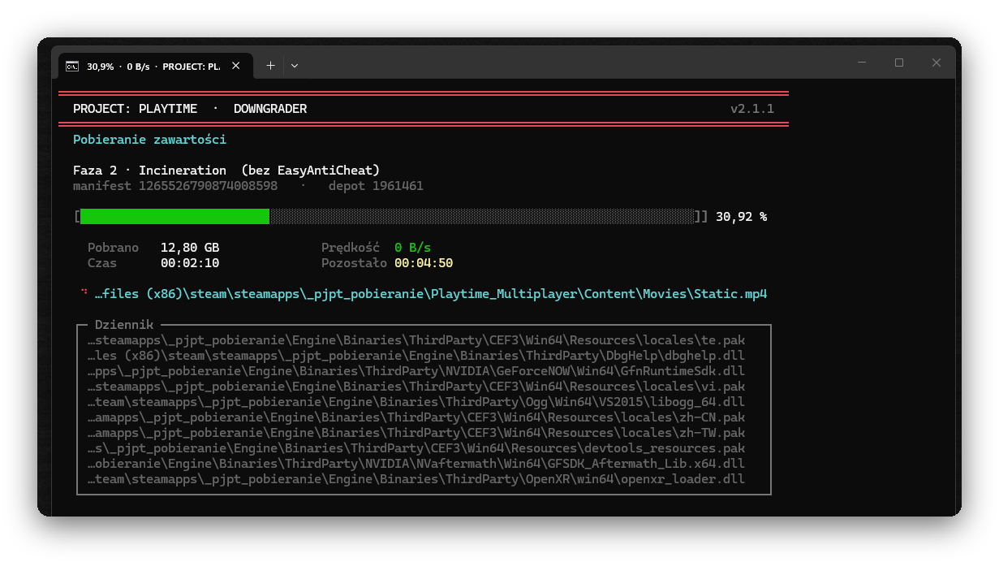
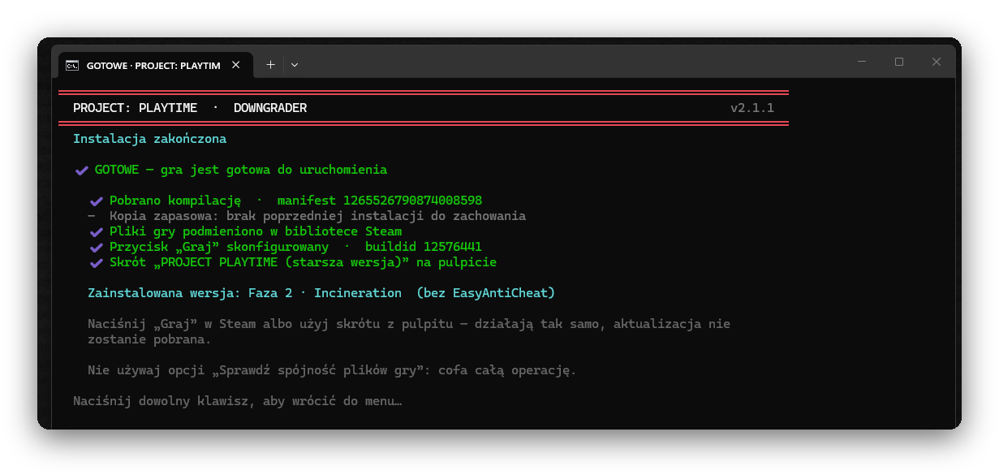
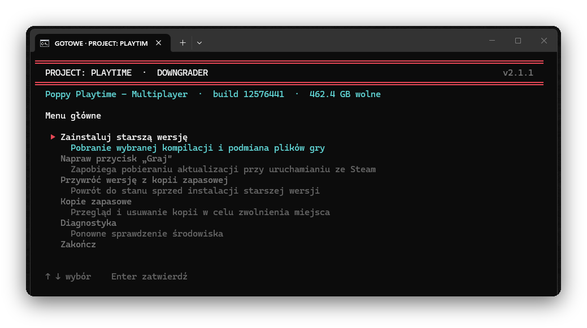

<div align="center">


<br>


**Instalator starszych kompilacji gry PROJECT: PLAYTIME.**
Pobiera wybraną wersję prosto z serwerów Steam, podmienia pliki
i sprawia, że **przycisk „Graj” uruchamia ją zamiast pobierać aktualizację**.

Jeden plik do kliknięcia. Zero konfiguracji, zero zależności do zainstalowania.

</div>

---

## Interfejs

<div align="center">



<sub>Pobieranie kompilacji — pasek postępu o rozdzielczości ósmej części znaku,<br>
pomiar przepustowości, czas pozostały i przewijany dziennik plików</sub>

<br><br>



<sub>Podsumowanie — wykaz faktycznie wykonanych kroków, każdy z własnym stanem</sub>

<br><br>



<sub>Menu obsługiwane strzałkami; nagłówek pokazuje wykrytą instalację,<br>
numer kompilacji i wolne miejsce na dysku</sub>

</div>

Układ dopasowuje się do rozmiaru okna — tekst jest zawijany na granicy słów,
a zmiana wymiarów w trakcie pobierania powoduje przerysowanie ekranu od nowa.
Postęp trafia też do tytułu okna, więc widać go na pasku zadań przy oknie
zminimalizowanym.

---

## Uruchomienie

> **Pobierz repozytorium i kliknij dwukrotnie `Start.bat`.**
> DepotDownloader pobierze się sam przy pierwszym uruchomieniu.

Albo z konsoli:

```bash
powershell -ExecutionPolicy Bypass -File .\src\PJPT-Downgrader.ps1
```

---

## Przycisk „Graj” — sedno sprawy

Poradniki krążące po sieci kończą się radą: _nie naciskaj „Graj” w Steam,
uruchamiaj grę z pliku `.exe`_. Nie jest to konieczne.

Klient Steam **nie sprawdza zawartości katalogu gry**. Decydując o aktualizacji,
porównuje wyłącznie metadane z pliku `appmanifest_1961460.acf` z informacjami
pobranymi z serwera. Sumy kontrolne plików liczy dopiero po ręcznym uruchomieniu
opcji _Sprawdź spójność plików gry_.

Program zapisuje więc w appmanifest stan „instalacja kompletna i aktualna”,
podczas gdy na dysku leżą pliki starszej kompilacji.

> [!IMPORTANT]
> Samo ustawienie `buildid` **nie wystarcza**. Klient sprawdza cały zestaw pól
> i musi je zobaczyć spójne ze sobą. Najważniejsza jest lista `InstalledDepots`:
> dopóki jest pusta, Steam uznaje, że żaden depot nie jest zainstalowany, dopisuje
> do `StateFlags` bit wymaganej aktualizacji i żąda pobrania całości — niezależnie
> od numeru kompilacji.

| Wpis | Wartość | Znaczenie |
|:--|:--|:--|
| `InstalledDepots` | depot z identyfikatorem manifestu bieżącej wersji | **kluczowe** — pusta lista wymusza pełne pobranie |
| `StateFlags` | `4` | „w pełni zainstalowana”; wartość `6` to `4` + bit wymaganej aktualizacji |
| `buildid`, `TargetBuildID` | bieżąca kompilacja publiczna | zgodność z wersją na serwerze |
| `SizeOnDisk`, `BytesToStage`, `BytesStaged` | rozmiar zawartości depotu | zero oznacza dla klienta pustą instalację |
| `BytesDownloaded` | równe `BytesToDownload` | pobieranie ukończone w stu procentach |
| `LastUpdated` | znacznik czasu | zero wygląda jak instalacja nigdy niedokończona |
| `DownloadType` | `1` | zwykła instalacja zamiast oczekującego pobierania |
| `AutoUpdateBehavior` | `1` | brak aktualizacji w tle |

Wartości manifestu i rozmiarów pobierane są z `api.steamcmd.net`, z pola
`depots.1961461.manifests.public`. Wszystkie pola zapisywane są w jednym przebiegu,
a plik podmieniany atomowo.

Efekt: **Graj** uruchamia grę natychmiast, bez pobierania czegokolwiek.

W przypadku tej gry rozwiązanie jest wyjątkowo trwałe. Ostatnia publiczna
aktualizacja PROJECT: PLAYTIME miała miejsce **30 października 2023** (build
`12576441`). Dopóki nie pojawi się nowa kompilacja, identyfikator się nie zmienia
i konfiguracja obowiązuje bezterminowo. Po ewentualnej łatce wystarczy pozycja
menu _Napraw przycisk „Graj”_ — program odpyta `api.steamcmd.net` o aktualny
identyfikator i zapisze go ponownie.

> [!WARNING]
> Jedyna operacja cofająca cały zabieg to **Sprawdź spójność plików gry**
> w kliencie Steam. Wykrywa różnicę i pobiera wersję aktualną.

---

## Gdy gra nie jest zainstalowana

Program nie kończy działania komunikatem „zainstaluj grę i wróć”. Sam doprowadza
system do wymaganego stanu: uruchamia klienta Steam, otwiera okno instalacji
(`steam://install/1961460`, dla gry darmowej obejmuje to dodanie jej do konta)
i czeka na potwierdzenie. Kliknięcie **Instaluj** pozostaje po stronie
użytkownika — dodania produktu do konta nie powinien wykonywać za niego skrypt.

Dalej dostępne są dwa warianty:

| Wariant | Pobiera | Jak działa |
|:--|:--:|:--|
| **Zarejestruj i pobierz od razu starszą wersję** | ~12 GB | Steam tworzy wpis instalacji, pobieranie bazowe zostaje natychmiast wstrzymane, a jego pozostałości usunięte. Na dysk trafia wyłącznie wybrana kompilacja |
| **Zainstaluj pełną wersję bieżącą, potem ją cofnij** | ~24 GB | Klient Steam pobiera całość, program pokazuje jego postęp, po czym wykonuje podmianę |

Wariant oszczędny wynika z prostej obserwacji: z wersji bazowej potrzebny jest
wyłącznie **wpis `appmanifest`**, a Steam zapisuje go w chwili zakolejkowania
pobierania — na długo przed ściągnięciem pierwszego gigabajta. Pobieranie 12 GB
wersji bieżącej tylko po to, aby za chwilę zastąpić ją inną, jest zbędne.

Postęp instalacji bazowej odczytywany jest z pól `BytesDownloaded`
i `BytesToDownload` w appmanifest, więc pasek postępu działa również dla
pobierania prowadzonego przez samego Steam.

## Funkcje

| Pozycja menu | Opis |
|:--|:--|
| **Zainstaluj starszą wersję** | Pobranie kompilacji i podmiana plików wraz z kopią zapasową. Gdy gry nie ma — najpierw jej rejestracja w Steam |
| **Napraw przycisk „Graj”** | Ponowne zapisanie metadanych, gdy Steam zaplanował aktualizację |
| **Przywróć wersję z kopii zapasowej** | Powrót do stanu sprzed operacji |
| **Kopie zapasowe** | Przegląd i usuwanie kopii w celu zwolnienia miejsca |
| **Diagnostyka** | Wykrycie Steam, biblioteki, kompilacji i wolnego miejsca |

## Dostępne kompilacje

| Wersja | Manifest | Uwaga |
|:--|:--|:--|
| Faza 2 · Incineration — bez EasyAntiCheat | `1265526790874008598` | faktyczne cofnięcie wersji |
| Faza 2 · Incineration — z EasyAntiCheat | `1362072626294775891` | **to jest wersja bieżąca** |

Drugi manifest odpowiada bieżącej kompilacji publicznej — API zwraca go jako
`depots.1961461.manifests.public.gid`. Gra zakończyła życie na Fazie 2
z anticheatem, więc jej zainstalowanie niczego nie cofa; pozycja pozostaje
w menu na wypadek, gdyby ktoś chciał wrócić do stanu wyjściowego.

W menu można podać dowolny inny identyfikator. Pełna lista kompilacji wraz
z datami: [SteamDB — depot 1961461](https://steamdb.info/depot/1961461/manifests/).

<div align="center">

| App ID | Depot ID | Rozmiar pobierania |
|:--:|:--:|:--:|
| `1961460` | `1961461` | ~12 GB |

</div>

---

## Wymagania

- Windows 10 lub 11
- Windows PowerShell 5.1 (element systemu) albo PowerShell 7
- Konto Steam — gra jest darmowa, a program sam poprowadzi przez dodanie jej do konta
- Około 14 GB wolnego miejsca (pobranie plus kopia zapasowa)

Gra nie musi być wcześniej zainstalowana — patrz [sekcja powyżej](#gdy-gra-nie-jest-zainstalowana).

## Logowanie

Uwierzytelnianie realizuje [DepotDownloader](https://github.com/SteamRE/DepotDownloader)
(projekt SteamRE). Hasło i kod Steam Guard wpisywane są bezpośrednio w oknie tego
narzędzia — repozytorium nie zawiera kodu obsługującego hasła i nigdzie ich nie zapisuje.

| Tryb | Postęp | Uwagi |
|:--|:--|:--|
| **Nazwa użytkownika i hasło** | pełny interfejs | Logowanie w osobnym kroku |
| **Kod QR** | pełny interfejs | Bez hasła, potwierdzenie w Steam Mobile |

Oba tryby rozdzielają logowanie i pobieranie na dwa uruchomienia narzędzia.
Wynika to z jego ograniczenia: hasło czytane jest przez `Console.ReadKey`, co przy
przekierowanym wejściu kończy się wyjątkiem, więc nie da się jednocześnie obsłużyć
logowania i przechwytywać wyjścia na potrzeby paska postępu. Pierwsze uruchomienie
zajmuje się wyłącznie uwierzytelnieniem, drugie — korzystając z zapisanego tokenu —
pobieraniem z pełnym podglądem.

W trybie QR nazwa konta nie jest znana z góry, a bez niej drugie uruchomienie
wymagałoby zeskanowania kolejnego kodu. Program odczytuje ją więc z pliku
`account.config`, w którym DepotDownloader zapisuje token: nazwa konta występuje
tam jako klucz słownika. Gdy odczyt jest niejednoznaczny, pojawia się menu wyboru,
a gdy zawiedzie — pobieranie wraca do trybu tekstowego.

### Skoro klient Steam jest zalogowany, po co drugie logowanie?

DepotDownloader nie jest wtyczką do klienta Steam, tylko **osobnym programem
z własnym połączeniem** do serwerów Valve (implementacja SteamKit2). Sesja klienta
jest zaszyfrowana i związana z jego procesem — nie istnieje wspierany sposób jej
pożyczenia. Aby pobrać wskazaną kompilację, narzędzie musi samodzielnie uzyskać
klucz depotu, a do tego potrzebuje uwierzytelnienia na koncie posiadającym grę.

Okno instalacji, które pojawia się wcześniej, to zupełnie inna operacja — klient
Steam pobiera wtedy wersję bieżącą, aby powstał wpis `appmanifest`.

**Logowanie jest jednorazowe.** Token sesji zostaje zapisany
(`-remember-password`), a nazwa konta zapamiętana, więc przy kolejnych
uruchomieniach w menu pojawia się pozycja _Kontynuuj jako …_ i hasło nie jest
już potrzebne. To samo wyjaśnienie dostępne jest w programie pod pozycją
_Dlaczego to jest wymagane?_.

> [!NOTE]
> Obie sesje otrzymują różne identyfikatory `LoginID`. Bez tego Steam zerwałby
> połączenie klienta w chwili zalogowania DepotDownloadera i wyrzucił użytkownika
> z aplikacji w trakcie pobierania.

---

## Struktura repozytorium

```
Start.bat                    punkt wejścia
src/
  PJPT-Downgrader.ps1        przebieg aplikacji i ekrany
  Tui.ps1                    ramki, menu, paski postępu, animacje
  Steam.ps1                  wykrywanie instalacji, appmanifest, podmiana katalogu
  Depot.ps1                  DepotDownloader, logowanie, parsowanie postępu
assets/                      logo i grafika repozytorium
docs/
  JAK-TO-DZIALA.md           szczegóły techniczne
tools/                       DepotDownloader (pobierany automatycznie)
logs/                        dzienniki sesji
```

Więcej o mechanizmie manifestów, pomiarze przepustowości i zabezpieczeniach
operacji na plikach: **[docs/JAK-TO-DZIALA.md](docs/JAK-TO-DZIALA.md)**.

---

## Metody alternatywne

### Konsola klienta Steam

Korzysta z sesji zalogowanego klienta, więc nie wymaga osobnego logowania.
W zamian nie ma podglądu postępu, a podmianę katalogu trzeba wykonać ręcznie:

```
steam://open/console
```

```
download_depot 1961460 1961461 1265526790874008598
```

Pliki trafiają do `steamapps\content\app_1961460\depot_1961461`.

### SteamCMD

Oficjalne narzędzie wiersza poleceń Valve obsługuje tę samą komendę:

```
login <nazwa_konta>
download_depot 1961460 1961461 1265526790874008598
```

Dla kompilacji z gałęzi publicznej — a takimi są obie Fazy 2 — działa.
Potwierdzone ograniczenie dotyczy manifestów, które istniały **wyłącznie na
gałęziach beta**: `download_depot` zwraca wtedy `Manifest unavailable`
([zgłoszenie u Valve](https://github.com/valvesoftware/steam-for-linux/issues/12138),
otwarte od czerwca 2025).

Dlaczego mimo to program korzysta z DepotDownloadera:

| | SteamCMD | DepotDownloader |
|:--|:--|:--|
| Osobne logowanie | wymagane | wymagane |
| Kolizja sesji z klientem Steam | [znany problem, brak kontroli](https://steamcommunity.com/discussions/forum/10/6725643788913804437/) | rozwiązana parametrem `-loginid` |
| Postęp pobierania | jedna linia na końcu | procent i nazwa pliku na bieżąco |
| Rozmiar narzędzia | setki MB po samoaktualizacji | 32 MB |

Kluczowe: **SteamCMD nie eliminuje osobnego logowania** — to również niezależny
klient z własnym `config.vdf`. Kolizja jego sesji z sesją klienta Steam jest
zgłaszana od lat i nie daje się obejść, bo SteamCMD nie udostępnia odpowiednika
parametru `-loginid`. Byłby to więc krok wstecz względem tego, co naprawiono
w wersji 1.1.1.

---

## Uwagi

- Rozgrywka sieciowa wymaga tej samej kompilacji u wszystkich uczestników.
- Klient Steam musi działać w tle, aby gra rozpoznała konto.
- Program nie modyfikuje plików gry ani nie omija zabezpieczeń — pobiera wyłącznie
  zawartość udostępnianą przez Steam dla posiadanego konta.

## Licencja

[MIT](LICENSE)

<div align="center">
<sub>Projekt niezależny, niepowiązany z Mob Entertainment ani Valve.<br>
Logo jest oryginalną grafiką wektorową stworzoną na potrzeby tego repozytorium.</sub>
</div>
